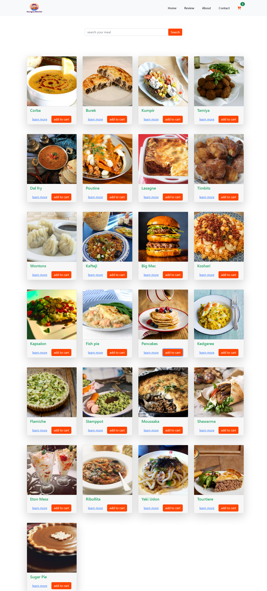

# **Hungry-Monster**
### `Website Link :` 

## About & Features

- **Hungry-Monster** is a single-page online food order website. it is a simple react-router application. The website dynamically changes the route with the URL.. 
- The website is built with React, React-Router and React-Bootstrap.
- And has been used an API called [The Meal DB](https://www.themealdb.com/api.php).
- There is a Homepage. The homepage has a search input field and displays food items, a button named add to cart and a Link name learn more.
- If you click on the add to cart button, you will be adding the meal to your cart and you click on the learn more Link taken to the next page to view Meal detail.
- On the Meal details page, you can remove the meal on your cart.
- And there is a 404 - PAGE NOT FOUND section if anyone types the wrong URL that does not have any page on a website.

### Front-end Technology Used : 
- **React, React-Router-Dom,**
- **React-Bootstrap-5**
- **CSS3**
- **TheMealDB-API**

